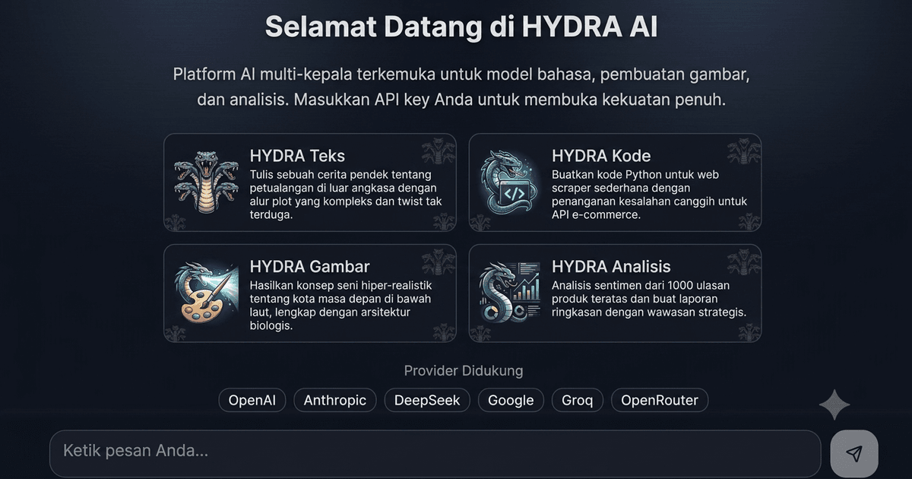

<div align="center">
  
</div>

<br/>

# 🐉 Hydra AI Platform

Multi-model AI chat platform with coding assistant, file analysis, image understanding, and web search agent — all in one place.


## ✨ Features

- 🤖 **4 Chat Modes**: Chat, Coding, Analysis, Agent
- 🌐 **Multi-Provider AI**: OpenAI, Google Gemini, Anthropic Claude, DeepSeek, Groq, Mistral, OpenRouter, Together AI
- 💻 **Coding Assistant**: Code generation, debugging, refactoring
- 📄 **File Upload**: PDF parsing, code file analysis
- 🖼️ **Image Analysis**: Vision AI understands uploaded images
- 🔍 **Web Search**: Agent mode searches the internet for real-time info
- 🎨 **Modern UI**: Dark/light theme with smooth animations
- 🔐 **Authentication**: GitHub OAuth + credentials login
- 💾 **Chat History**: Save and manage conversation history
- 📱 **Responsive**: Works on desktop and mobile
- 🔑 **Bring Your Own Key**: Use your own API key from any supported provider

## 🌐 Supported AI Providers

| Provider | Models | Base URL |
|----------|--------|----------|
| **OpenAI** | GPT-4o, GPT-4o Mini, GPT-4 Turbo, GPT-3.5 | `https://api.openai.com/v1` |
| **Anthropic** | Claude Sonnet 4, Claude 3.5 Sonnet/Haiku | `https://api.anthropic.com/v1` |
| **Google** | Gemini 2.5 Flash/Pro, Gemini 2.0 Flash | `https://generativelanguage.googleapis.com/v1beta/openai` |
| **DeepSeek** | DeepSeek Chat, DeepSeek Reasoner | `https://api.deepseek.com/v1` |
| **Groq** | Llama 3.3 70B, Llama 3.1 8B, Mixtral | `https://api.groq.com/openai/v1` |
| **Mistral** | Mistral Large, Mistral Small | `https://api.mistral.ai/v1` |
| **OpenRouter** | Qwen3, Llama, Gemini (multi-provider) | `https://openrouter.ai/api/v1` |
| **Together AI** | Llama 3, Qwen 2.5 | `https://api.together.xyz/v1` |

> 💡 Any OpenAI-compatible API endpoint works! Just set the base URL and your API key.

## 🚀 Quick Start

### Prerequisites

- Node.js 20+
- npm or bun
- An API key from any supported AI provider

### 1. Clone the repository

```bash
git clone https://github.com/Alexahydra92/hydra-Ai-Platform-Free.git
cd hydra-Ai-Platform-Free
```

### 2. Install dependencies

```bash
npm install --legacy-peer-deps
```

### 3. Set up environment variables

```bash
cp .env.example .env
```

Edit `.env` and fill in your values:

```env
DATABASE_URL="file:./db/hydra.db"
DEFAULT_API_KEY=your-api-key-here
DEFAULT_BASE_URL=https://api.openai.com/v1
DEFAULT_MODEL=gpt-4o-mini
NEXTAUTH_SECRET=generate-a-random-secret-here
NEXTAUTH_URL=http://localhost:3000
```

> Get your API key from: [OpenAI](https://platform.openai.com), [DeepSeek](https://platform.deepseek.com), [Groq](https://console.groq.com), [Google AI](https://aistudio.google.com), etc.

### 4. Initialize the database

```bash
npx prisma db push
```

### 5. Run the development server

```bash
npm run dev
```

Open [http://localhost:3000](http://localhost:3000) in your browser.

## 🐳 Docker Deployment

### Build and run with Docker

```bash
docker build -t hydra-ai .
docker run -p 3000:3000 \
  -e DEFAULT_API_KEY=your-api-key \
  -e DEFAULT_BASE_URL=https://api.openai.com/v1 \
  -e DEFAULT_MODEL=gpt-4o-mini \
  -e NEXTAUTH_SECRET=your-secret \
  -e NEXTAUTH_URL=http://localhost:3000 \
  -v hydra-data:/app/data \
  hydra-ai
```

### Deploy to Railway

1. Fork or clone this repo to your GitHub
2. Go to [Railway.app](https://railway.app) and sign in with GitHub
3. Create a new project → Deploy from GitHub repo
4. Select `hydra-Ai-Platform-Free`
5. Add environment variables:
   - `DEFAULT_API_KEY` — your AI provider API key
   - `DEFAULT_BASE_URL` — provider API base URL
   - `DEFAULT_MODEL` — default model name
   - `NEXTAUTH_SECRET` — random secret string
   - `DATABASE_URL` — `file:/app/data/hydra.db`
6. Deploy! Railway will auto-detect the Dockerfile

## ⚙️ Environment Variables

| Variable | Required | Description |
|----------|----------|-------------|
| `DEFAULT_API_KEY` | ✅ | API key for the default AI provider |
| `DEFAULT_BASE_URL` | ✅ | Base URL for the default AI provider |
| `DEFAULT_MODEL` | ✅ | Default model name (e.g. `gpt-4o-mini`) |
| `NEXTAUTH_SECRET` | ✅ | Secret for NextAuth.js authentication |
| `NEXTAUTH_URL` | ✅ | Your app URL (e.g. `https://your-app.railway.app`) |
| `DATABASE_URL` | ✅ | SQLite database path (default: `file:/app/data/hydra.db`) |
| `GITHUB_ID` | ❌ | GitHub OAuth App ID for GitHub login |
| `GITHUB_SECRET` | ❌ | GitHub OAuth App Secret for GitHub login |
| `ZAI_API_KEY` | ❌ | Legacy Z.ai API key (fallback for DEFAULT_API_KEY) |

## 🏗️ Tech Stack

- **Frontend**: Next.js 16, React 19, TypeScript, Tailwind CSS, shadcn/ui
- **Backend**: Next.js API Routes, Prisma ORM, SQLite
- **AI**: Multi-provider (OpenAI-compatible API), Vision Language Model
- **Auth**: NextAuth.js v4 (GitHub OAuth + Credentials)
- **Deployment**: Docker, Railway
- **Features**: PDF parsing, Image analysis, Web search agent

## 📂 Project Structure

```
├── src/
│   ├── app/
│   │   ├── api/
│   │   │   ├── chat/route.ts      # AI chat endpoint (multi-provider)
│   │   │   ├── upload/route.ts    # File upload endpoint
│   │   │   ├── search/route.ts    # Web search endpoint
│   │   │   └── auth/              # NextAuth routes
│   │   ├── page.tsx               # Main app UI
│   │   └── layout.tsx             # Root layout
│   ├── components/ui/             # shadcn/ui components
│   ├── lib/
│   │   ├── auth.ts                # NextAuth config
│   │   ├── auth-provider.tsx      # Auth context provider
│   │   └── db.ts                  # Prisma client
│   └── hooks/                     # Custom React hooks
├── prisma/
│   └── schema.prisma              # Database schema
├── Dockerfile                     # Multi-stage Docker build
├── docker-entrypoint.sh           # Auto DB migration on startup
├── railway.json                   # Railway deploy config
└── .env.example                   # Environment template
```

## 📝 License

MIT

---

Powered By @Alexa Hydra
